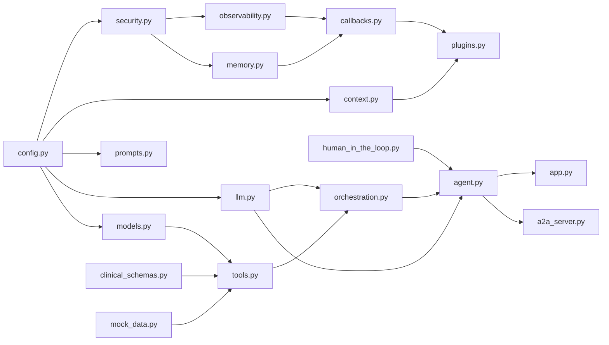

# Module Dependency Graph

> [!info] Auto-regenerated section
> The Mermaid graph between the AUTO markers is rewritten by `scripts/sync_wiki.py` from the actual intra-project imports on every sync. Do not hand-edit inside the markers.

<!-- AUTO:DEPGRAPH:BEGIN -->

<!-- AUTO:DEPGRAPH:END -->

## Design property

No circular dependencies. `config.py` and `prompts.py` are standalone; everything converges on `agent.py`, which wires the root agent, then `app.py` (runtime) and `a2a_server.py` (A2A serving) consume it.

Related: [[Module Reference]] · [[Agent Architecture]]
