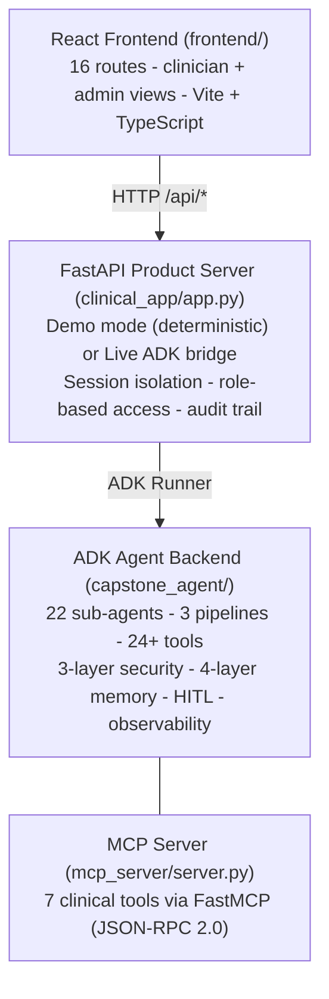

# System Overview

A multi-agent clinical AI platform built on Google ADK that processes medical imaging, answers patient questions with cited evidence, and runs natural-language database intelligence — all gated by clinician-in-the-loop review and HIPAA-aligned security.

## The four-layer stack

- **React frontend** — 16-route clinical UI (Vite + TypeScript), served as a production build by FastAPI. See [[Clinical App]].
- **FastAPI product server** (`clinical_app/`) — operates in deterministic demo mode or bridges live to the ADK runner; session isolation, role-based access, audit trail. See [[Clinical App]].
- **ADK agent backend** (`capstone_agent/`) — the agent pipelines, tools, security callbacks, memory, and observability. See [[Agent Architecture]] and [[Module Reference]].
- **MCP tool server** (`mcp_server/`) — real database-backed clinical tools exposed over the Model Context Protocol. See [[MCP and A2A]].

## Google Cloud ecosystem mapping

| Tool / Module | Cloud Service | Purpose |
|---------------|---------------|---------|
| `store_to_gcs`, `fetch_image_from_gcs` | Cloud Storage (GCS) | Clinical image and document storage |
| `lookup_patient_record` | Firestore | Structured patient records |
| `search_clinical_notes`, `search_vector_store` | Vertex AI Vector Search | Semantic search over embeddings |
| `execute_clinical_query` | Cloud SQL / BigQuery | Relational clinical data queries |
| `analyze_clinical_image`, `analyze_evidence_images` | Vertex AI (Gemini Vision) | Multimodal image analysis |
| `observability.py` | Cloud Trace (OTLP) | Distributed tracing |
| `observability.py` | Cloud Logging | Structured JSON logs + audit trail |
| `memory.py` | Vertex AI Memory Bank | Long-term cross-session memory |
| `app.py` (deploy) | Cloud Run / Agent Engine / GKE | Production hosting |

Related: [[Model Registry]] · [[Security Layers]] · [[Memory Layers]] · [[Deployment]]
