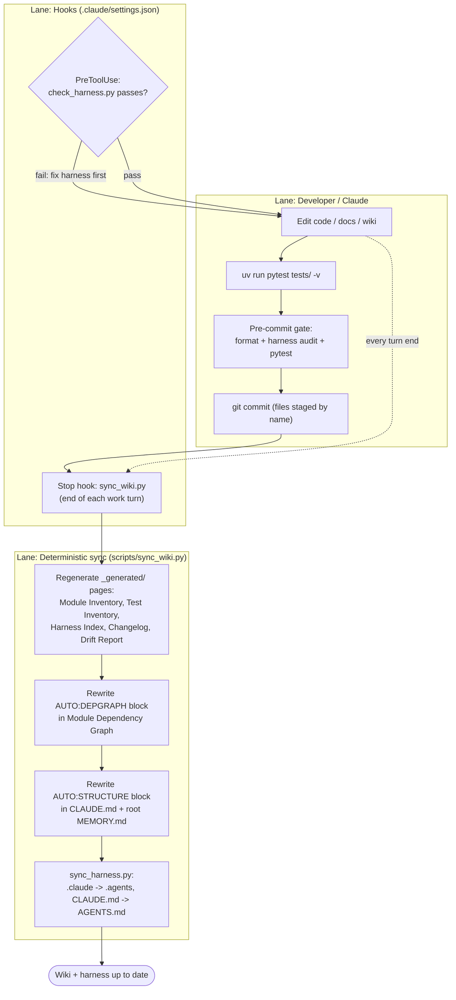

# Development Workflow

How work happens on this repository, including the automated wiki/harness sync layer. Lanes: Developer/Claude, Hooks, Sync.

Key facts:

- `check_harness.py` runs before **every** tool call (PreToolUse, matcher `.*`) and fails fast on harness drift — see [[Claude Harness]].
- `sync_wiki.py` runs at the end of every Claude work turn (Stop hook). It is deterministic (stdlib only, no LLM), idempotent, and always exits 0 — sync problems land in [[Drift Report]] instead of blocking.
- Machine-owned pages live in `_generated/`; AUTO-marked blocks in [[Module Dependency Graph]], `CLAUDE.md`, and root `MEMORY.md` are rewritten in place. Hand-written prose is never touched.
- After any CLAUDE.md change, `sync_harness.py` must mirror it to AGENTS.md — the sync script does this automatically as its last step.

Related: [[Claude Harness]] · [[Testing and Eval]]
