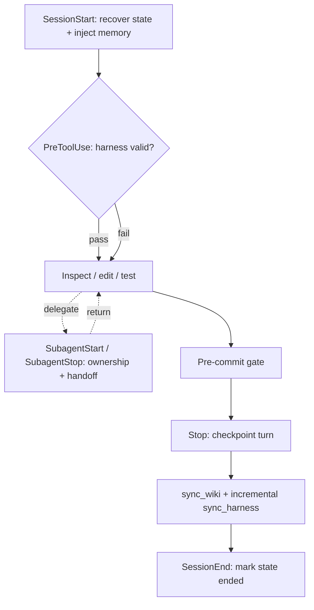

# Development Workflow

Key facts:

- `harness_runtime.py` manages SessionStart, PreCompact, subagent handoff, Stop,
  and SessionEnd transitions under gitignored `.claude/state/`.
- `check_harness.py` runs before every tool call and validates executable agent,
  memory, state, hook, index, and mirror contracts.
- `sync_wiki.py` is deterministic and idempotent; sync warnings land in
  [[Drift Report]].
- `sync_harness.py` only removes files named by its previous generated manifest,
  so destination-only `.agents/` assets survive.
- Machine-owned pages and `AUTO:*` blocks are never hand-edited.

Related: [[Claude Harness]] · [[Testing and Eval]]
