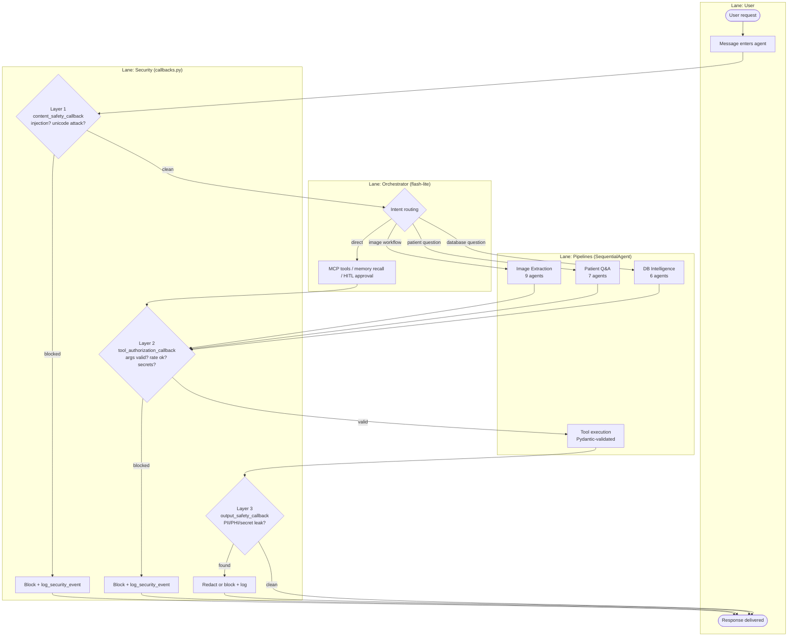

# End-to-End Request Flow

Every request crosses three security gates and one routing decision. BPMN-style lanes: User, Security, Orchestrator, Pipelines.

Key facts:

- Layer 1 blocks 18 injection/extraction patterns (15 generic + 3 HIPAA-specific) after unicode NFKC normalization.
- Layer 2 runs per tool call: Pydantic validation, `temp:` state rate limiting, secret scan on arguments.
- Layer 3 inspects every model response for PII, PHI, and secrets before it reaches the user.
- Every block/detection is logged via `observability.log_security_event()`.

Related: [[Security Layers]] · [[Agent Architecture]] · [[Image Extraction Pipeline]] · [[Patient QA Pipeline]] · [[DB Intelligence Pipeline]]
