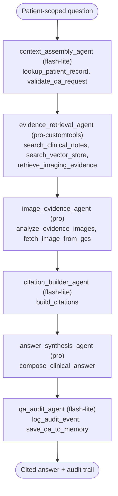

# Patient QA Pipeline

SequentialAgent (7 agents) answering clinical questions with cited evidence from notes, images, and vector search — grounded in patient context.

Key facts:

- Validation happens first: `validate_qa_request` rejects out-of-scope requests before any retrieval.
- Evidence is multimodal — text notes, vector search hits, and imaging pulled from GCS and analyzed by Gemini Vision.
- Every answer carries citations built before synthesis, so sources are traceable in the UI ([[Clinical App]]).
- The audit stage persists the exchange to long-term memory (`save_qa_to_memory`) with PHI filtered first ([[Memory Layers]] Layer 3).

Related: [[Agent Architecture]] · [[End-to-End Request Flow]]
