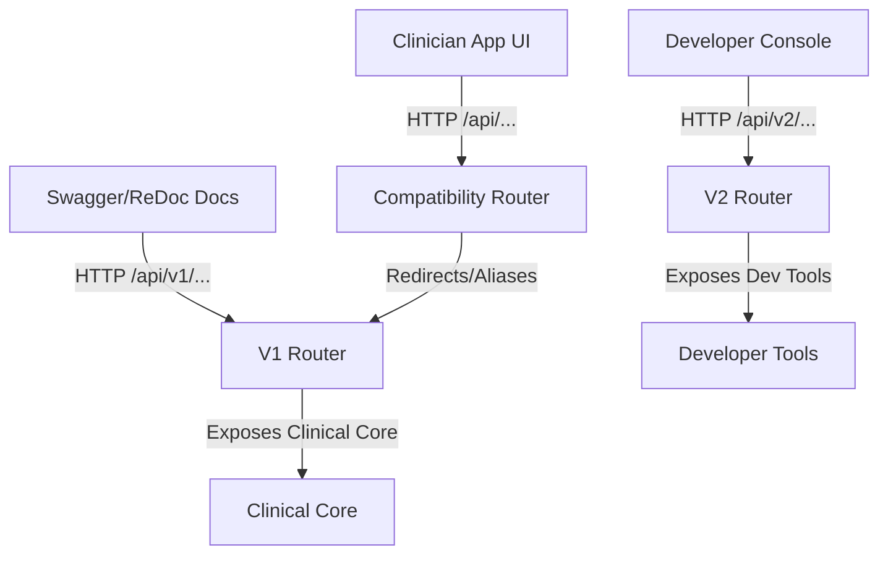

# REST API and Developer Console

Nexus exposes a versioned, secure REST API backend built on FastAPI and a React-based interactive Developer/API Console to assist developers in testing, auditing, and executing agent pipelines and MCP tools.

---

## 1. API Architecture & Versioning

The FastAPI product server (`clinical_app/app.py`) serves endpoints organized under distinct routers:

1. **V1 API (`/api/v1`)**: Core clinical endpoints exposing dashboard metrics, patients list, sessions status, GCS storage assets, notifications, and security logs.
2. **Compatibility API (`/api`)**: Re-mounts the V1 router to guarantee complete backward compatibility with all legacy integration scripts and tests.
3. **V2 API (`/api/v2`)**: System diagnostics health checking, FastMCP server tool catalogs discovery, dynamic tool execution runner, and Agent-to-Agent card exposure.

---

## 2. API Endpoints Reference

### V1 API (Clinical Operations)

| Method | Path | Summary | Tags |
|--------|------|---------|------|
| `GET` | `/api/v1/health` | V1 liveness check | `Health` |
| `GET` | `/api/v1/agents` | Expose the real ADK pipeline catalog and execution mode | `Agents` |
| `GET` | `/api/v1/notifications` | List unresolved notifications from agents | `Notifications` |
| `POST` | `/api/v1/notifications/{notification_id}/read` | Mark one notification as read | `Notifications` |
| `GET` | `/api/v1/system/health` | Measured component health for database, runtime, MCP, storage, model credentials, and bundle | `Health` |
| `GET` | `/api/v1/agents/monitoring` | Per-agent runtime statistics for admin monitoring | `Agents` |
| `GET` | `/api/v1/permissions` | Role-permission matrix | `Admin` |
| `PUT` | `/api/v1/permissions` | Persist edited role-permission matrix | `Admin` |
| `GET` | `/api/v1/database/schema` | Clinical database tables parsed from governed DDL | `Database` |
| `GET` | `/api/v1/summary` | Live workspace counts for navigation badges | `Dashboard` |
| `GET` | `/api/v1/dashboard` | Retrieved global metrics and recent activity dashboard details | `Dashboard` |
| `GET` | `/api/v1/patients` | List of matched patient profiles according to criteria | `Patients` |
| `GET` | `/api/v1/patients/{patient_id}` | Detailed patient profile and current risk metadata | `Patients` |
| `GET` | `/api/v1/patients/{patient_id}/evidence` | Evidence sources for one patient | `Patients` |
| `GET` | `/api/v1/sessions` | List of recent clinical extraction sessions | `Sessions` |
| `GET` | `/api/v1/sessions/{session_id}` | Detailed session status and confidence scores | `Sessions` |
| `POST` | `/api/v1/assets` | Asset uploaded and recorded successfully | `Assets` |
| `POST` | `/api/v1/knowledge-base/assets` | Upload and index a patient-scoped document for Q&A retrieval | `Assets` |
| `GET` | `/api/v1/assets/{asset_id}` | Serve uploaded evidence bytes for authorized preview | `Assets` |
| `POST` | `/api/v1/demo/session` | Create an isolated deterministic demo session | `Demo` |
| `POST` | `/api/v1/demo/reset` | Reset the caller's deterministic demo session | `Demo` |
| `GET` | `/api/v1/storage` | Retrieved storage system metrics and totals | `Storage` |
| `GET` | `/api/v1/visuals/{document_id}` | Serve patient structured visual image binary data | `Storage` |
| `GET` | `/api/v1/agent-config` | Current agent validation thresholds and concurrent limits | `Admin` |
| `PUT` | `/api/v1/agent-config` | Updated and persisted new agent thresholds configuration | `Admin` |
| `GET` | `/api/v1/audit` | Immutable compliance activity and security log history | `Admin` |
| `POST` | `/api/v1/runs/extraction` | Began deterministic extraction pipeline on report assets | `Extraction` |
| `GET` | `/api/v1/runs/{run_id}` | Poll status, confidence, and current stage of active run | `Runs` |
| `GET` | `/api/v1/runs/{run_id}/events` | Retrieved list of completed run step execution events | `Runs` |
| `GET` | `/api/v1/runs/{run_id}/events/stream` | Server-Sent Events (SSE) stream of run progress | `Runs` |
| `POST` | `/api/v1/runs/{run_id}/review` | Recorded review decision to approve or reject extraction | `Runs` |
| `GET` | `/api/v1/reviews` | List extraction runs awaiting clinician review | `Runs` |
| `POST` | `/api/v1/orchestrate` | Classify user query and structure orchestrator route | `Orchestration` |
| `POST` | `/api/v1/runs/qa` | Began patient-grounded QA retrieval pipeline execution | `QA` |
| `POST` | `/api/v1/runs/database/preview` | Began database preview pipeline to generate SQL | `Database` |
| `POST` | `/api/v1/runs/database/{run_id}/execute` | Executed approved SQL query and saved table/charts | `Database` |
| `GET` | `/api/v1/database/history` | Retrieved database cohort run history | `Database` |
| `GET` | `/api/v1/database/queries/{run_id}/csv` | Retrieved query results exported as a CSV stream | `Database` |
| `GET` | `/api/v1/users` | Retrieved corporate user directory | `Admin` |

### V2 API (Developer & Interoperability Operations)

| Method | Path | Summary | Tags |
|--------|------|---------|------|
| `GET` | `/api/v2/health` | Health diagnostic metrics including database connection check | `System V2` |
| `GET` | `/api/v2/mcp/tools` | Expose all database tools available over MCP | `MCP V2` |
| `POST` | `/api/v2/mcp/execute` | Gated dynamic execution of an MCP tool | `MCP V2` |
| `GET` | `/api/v2/a2a/card` | Expose the Agent Card metadata for Agent-to-Agent discovery | `A2A V2` |

---

## 3. Swagger & ReDoc Console Branding

The default Swagger page (`/docs`) has been customized to deliver a premium developer experience aligned with the Clinical Command Center style guide:
- **Theme**: Premium custom CSS injecting a glassmorphic dark background (`#0b0f19`), rounded method blocks, consistent custom buttons, and monospace font arrays.
- **Exhaustiveness**: Schema-included V1/V2 endpoints declare success descriptions and the shared structured error responses (`400`, `401`, `403`, `404`, `422`, `500`) where they are served through the clinical API.
- **Routing Isolation**: The compatibility router `/api/...` endpoints are excluded from the Swagger schema (`include_in_schema=False`) to avoid duplication and clutter, highlighting only the `/api/v1` and `/api/v2` endpoints.
- **Static Asset Boundary**: The Diagram Atlas SVG/PNG assets are product and wiki documentation surfaces, not OpenAPI operations; they are cataloged in [[Diagram Atlas]] and rendered by the frontend.

---

## 4. Interactive Developer Console

The Developer Console (**`/app/console`**) serves as a central hub for operators and admins:

1. **API Endpoint Runner**: A Swagger-like interactive client built natively in React. Supports setting session context headers (`X-Demo-Session`, `X-Clinical-Role`, `X-Tenant`), parameters, and request body JSON payloads with response latency audits.
2. **MCP Playground**: Dynamically lists registered FastMCP tools and parameters, enabling safe playground executions directly from the UI.
3. **Agent Card**: Visualizes the remote agent discovery descriptors (pipeline sequence lists, tools, prompt instructions) served by the A2A endpoint.
4. **OpenAPI Spec Explorer**: Formatted JSON explorer for inspecting the raw `/openapi.json` spec.

> [!tip] Onboarding Tour Bypass
> Navigating directly to the Developer Console `/app/console` automatically overrides and bypasses the frontend Onboarding Tour, marking `clinicalOnboardingV1` as `done` in `localStorage` to ensure immediate, uninterrupted developer access.

---

Related: [[Clinical App]] · [[MCP and A2A]] · [[System Overview]]
