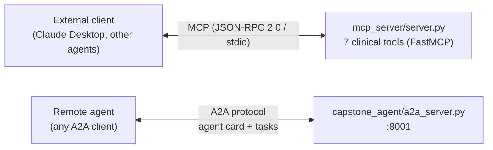

# MCP and A2A

> Source: Project Wiki/06 Operations/MCP and A2A.md
> Collected: 2026-07-05
> Published: 2026-07-04

# MCP and A2A

Two interoperability surfaces let external clients and agents use Nexus capabilities.



## MCP server

`mcp_server/server.py` — a clinical MCP server with **real database-backed tools** exposed via FastMCP (JSON-RPC 2.0 over stdio). Any MCP-compatible client (ADK, Claude Desktop, other frameworks) can discover and call the 7 clinical tools. The root orchestrator also consumes MCP tools directly ([[Agent Architecture]]).

## A2A server

`capstone_agent/a2a_server.py` — `to_a2a(root_agent)` ASGI app (guarded import). Serves the agent card at `/.well-known/agent-card.json` describing capabilities, input/output schemas, and supported skills. Remote agents delegate tasks over the A2A protocol with **isolated memory context** — only task-relevant, non-sensitive data crosses the boundary (Layer 4 of [[Memory Layers]]).

```powershell
uvicorn capstone_agent.a2a_server:app --port 8001
```

Related: [[System Overview]] · [[Course Concepts Map]] (Days 2a, 5a)
