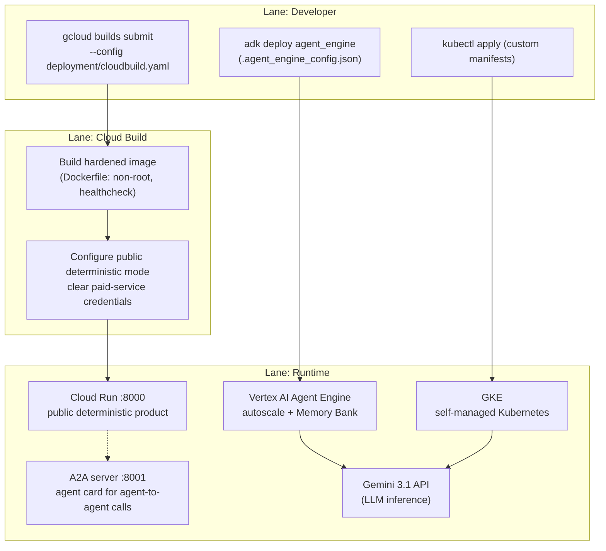

# Deployment Pipeline

> Source: Project Wiki/03 Processes/Deployment Pipeline.md
> Collected: 2026-07-05
> Published: 2026-07-04

# Deployment Pipeline

Three targets fed by one hardened build. Lanes: Developer, Cloud Build, Runtime.

Key facts:

- The public Cloud Run build disables paid ADK/Gemini execution and does not receive model credentials.
- Self-controlled Agent Engine or GKE live deployments load credentials at runtime; secrets are never baked into images ([[Deployment]]).
- The Dockerfile runs as a non-root user with a healthcheck on port 8000.
- Agent Engine deployments use `deployment/.agent_engine_config.json` for hardware config and add managed Memory Bank ([[Memory Layers]] Layer 3).
- The A2A server is a separate serving surface for agent-to-agent calls ([[MCP and A2A]]).

Related: [[Deployment]] · [[System Overview]]
