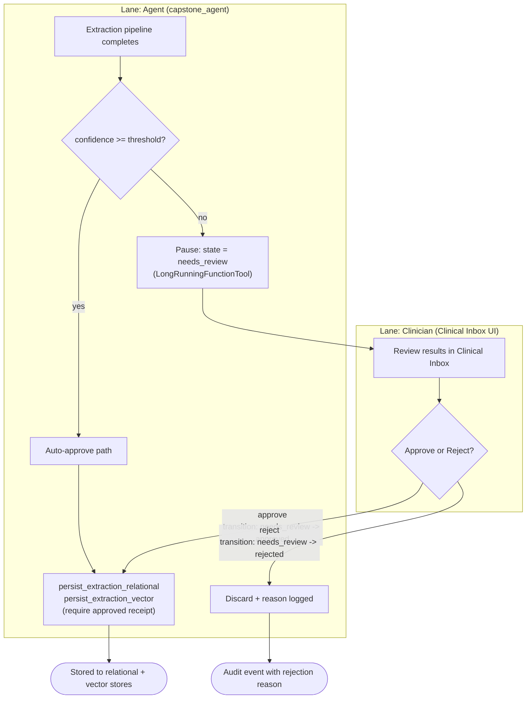

# Human-in-the-Loop Approval

> Source: Project Wiki/03 Processes/Human-in-the-Loop Approval.md
> Collected: 2026-07-05
> Published: 2026-07-04

# Human-in-the-Loop Approval

The clinical review gate (Day 2b) — a LongRunningFunctionTool pauses the pipeline until a clinician decides. This is the closest process to true BPMN: two lanes, one message flow, one exclusive gateway.

Key facts:

- `transition_extraction_review` enforces the state machine: only `needs_review` → `approved` or `needs_review` → `rejected` are valid transitions.
- Persistence tools **require an approved review receipt** — there is no code path that stores unreviewed low-confidence extractions.
- The pause/resume mechanism is ADK's `LongRunningFunctionTool` (`human_in_the_loop.py`).
- Review decisions are clinical audit events ([[Observability]]).

Related: [[Image Extraction Pipeline]] · [[Security Layers]] · [[Clinical App]]
