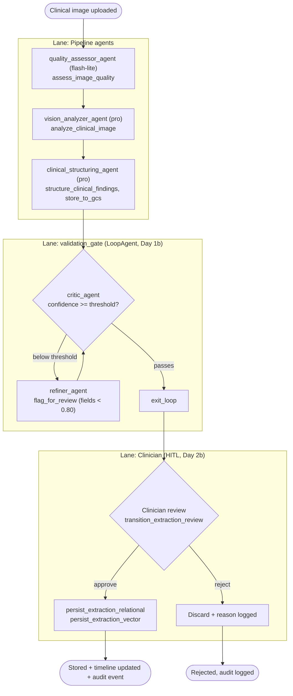

# Image Extraction Pipeline

> Source: Project Wiki/03 Processes/Image Extraction Pipeline.md
> Collected: 2026-07-05
> Published: 2026-07-04

# Image Extraction Pipeline

SequentialAgent (9 agents) processing clinical images through quality assessment, AI vision analysis, structured field extraction, a critic/refiner validation loop, and clinician review before persistence. Lanes: Agents, Validation Loop, Clinician.

Key facts:

- **output_key plumbing**: each agent writes its result to `session.state`; the next stage reads it — no direct coupling ([[Memory Layers]] Layer 2).
- The **LoopAgent** repeats critic → refiner until field confidence passes the threshold; fields below 0.80 are flagged for review.
- **State machine**: `transition_extraction_review` only allows `needs_review` → `approved` or `needs_review` → `rejected`. Persistence tools require an approved review receipt — see [[Human-in-the-Loop Approval]].

Related: [[Agent Architecture]] · [[End-to-End Request Flow]]
