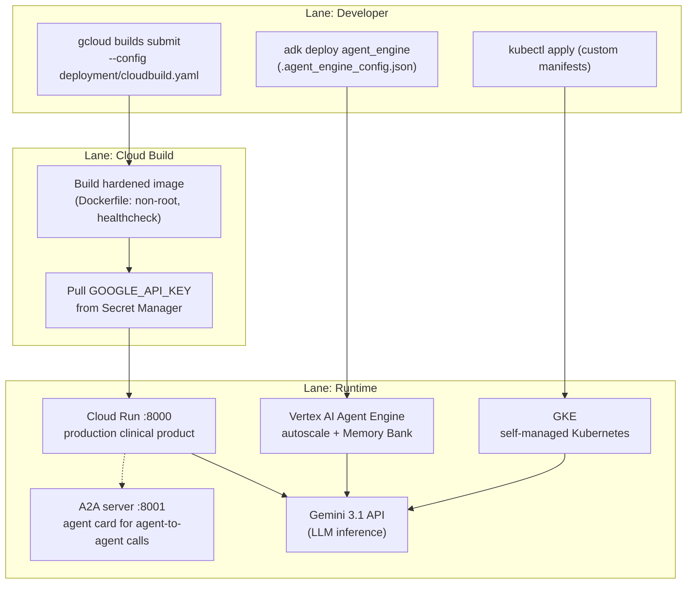

# Deployment Pipeline

> Sources: Antigravity, 2026-07-05
> Raw: [Deployment Pipeline Source](../../raw/processes/2026-07-04-deployment-pipeline.md)

# Deployment Pipeline

Three targets fed by one hardened build. Lanes: Developer, Cloud Build, Runtime.

Key facts:

- Secrets come from Secret Manager at build/runtime — never baked into images ([[Deployment]]).
- The Dockerfile runs as a non-root user with a healthcheck on port 8000.
- Agent Engine deployments use `deployment/.agent_engine_config.json` for hardware config and add managed Memory Bank ([[Memory Layers]] Layer 3).
- The A2A server is a separate serving surface for agent-to-agent calls ([[MCP and A2A]]).

Related: [[Deployment]] · [[System Overview]]
