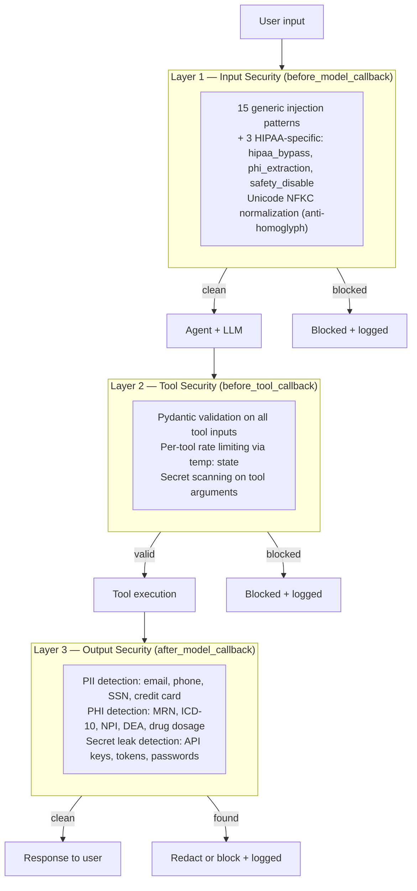

# Security Layers

> Sources: Antigravity, 2026-07-05
> Raw: [Security Layers Source](../../raw/security-memory/2026-07-04-security-layers.md)

# Security Layers

Defense in depth — three fixed callback layers plus clinical extensions. No single point of failure. All blocks are logged via `observability.log_security_event()` ([[Observability]]).

## The three callbacks (order is fixed)

| Layer | Callback | What it does |
|-------|----------|--------------|
| 1. Input | `content_safety_callback` (`before_model_callback`) | Sanitizes unicode (NFKC), blocks 18 injection/extraction patterns — 15 generic + 3 HIPAA-specific |
| 2. Tool | `tool_authorization_callback` (`before_tool_callback`) | Rate limits tool usage, Pydantic-validates arguments, scans arguments for secrets |
| 3. Output | `output_safety_callback` (`after_model_callback`) | Detects leaked secrets and PII/PHI in model responses; redacts or blocks |

Security logic lives in `security.py` as pure, testable functions (`scan_for_secrets`, `detect_pii`, `detect_phi`, `redact_phi`); `callbacks.py` wires it to ADK.

## Clinical extensions

- **PHI detection** adds clinical identifiers on top of PII: MRN, ICD-10 codes, NPI, DEA numbers, drug dosages.
- **`ClinicalAuditPlugin`** (`plugins.py`) tracks patient-data tool access, counts PHI detections, and flushes per-turn HIPAA audit summaries via `log_clinical_event()`.
- PHI is filtered before anything reaches long-term memory — see [[Memory Layers]].

## Rules

> [!warning] Invariants
> - The 3-layer callback order in `callbacks.py` is fixed and must be preserved.
> - All loggers route strings through `config.redact_secrets()` before emission.
> - Never write API keys or GCP credentials to long-term memory or session storage; run `redact_pii` before persisting memory layers.
> - Store sensitive config in `.env`, never commit API keys.

Related: [[End-to-End Request Flow]] · [[Testing & Eval]] (test_security.py, test_callbacks.py)
